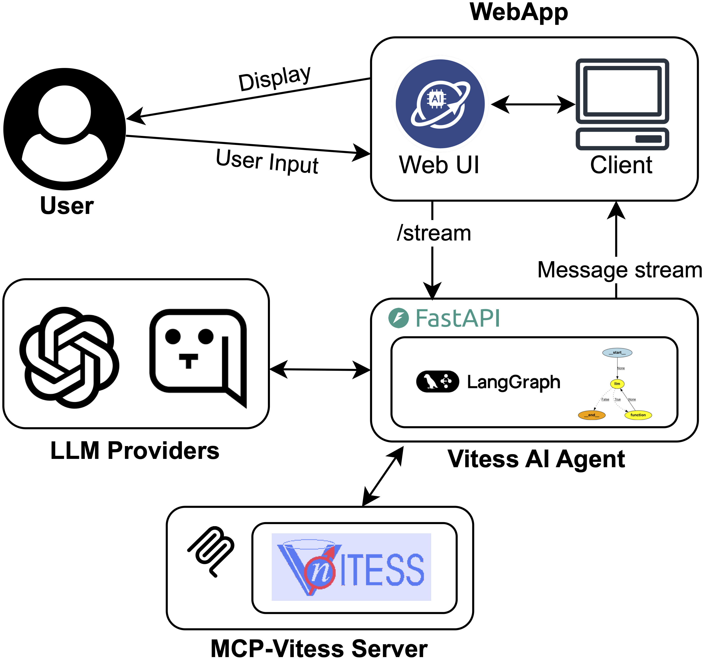

# VITESS AI Agent

<div align="center">
  
</div>

**VITESS AI Agent** is part of **Jülich Neutron AI Agents (JüNA)**, an agentic AI system designed to assist researchers in accessing and utilizing JCNS's extensive knowledge base in neutron science. This specific agent focuses on [VITESS](https://vitess.fz-juelich.de), an open-source software package for simulating neutron scattering experiments.

## Key Features

- **LangGraph-Based Architecture**: Multi-agent system built on LangGraph for orchestration
- **Multi-Agent Architecture**: Specialized AI agents for different simulation modules
- **RESTful API Server**: FastAPI-based server for programmatic access
- **Web Interface**: Streamlit-based chat interface with comprehensive configuration options
- **Real-time Streaming**: Server-Sent Events (SSE) for live conversation streaming
- **Multiple LLM Providers**: Support for OpenAI and Blablador (OpenAI-compatible API)
- **File Management**: Upload and manage files for different VITESS modules
- **Runtime Configuration**: Dynamic VITESS environment configuration

## Architecture

The system uses LangGraph to orchestrate specialized module agents in a unified workflow.

<div align="center">
  
</div>


## Prerequisites

**Critical Requirement**: You must have [VITESS](https://vitess.fz-juelich.de) installed on your system with the `vitess` command available in your PATH.

**System Requirements**: Python 3.13+, compatible with Windows, macOS, and Linux

## Installation

### Install uv (if not already installed)

If you don't have `uv` installed, install it first:

**macOS/Linux:**
```bash
curl -LsSf https://astral.sh/uv/install.sh | sh
```

**Windows:**
```powershell
powershell -ExecutionPolicy ByPass -c "irm https://astral.sh/uv/install.ps1 | iex"
```

After installation, restart your terminal or add `uv` to your PATH.

### Install Project Dependencies

**Using uv (recommended):**
```bash
uv sync
```

**Using pip:**
```bash
pip install .
```

## Configuration

### Setting Up Environment Variables

Copy the `env.example` file to `.env` and fill in your actual values:

**macOS/Linux:**
```bash
cp env.example .env
```

**Windows:**
```powershell
copy env.example .env
```

Then edit `.env` with your own configuration values. The `env.example` file contains comprehensive configuration options with detailed comments for each setting.

### Configuration Categories

The `env.example` file includes the following configuration sections:

- **Core API Keys**: API keys for your chosen LLM provider (OpenAI or Blablador)
- **LLM Provider Configuration**: Choose your provider (`openai` or `blablador`), models, and request settings
- **Blablador Settings**: Blablador API configuration (required if using Blablador)
- **LangSmith Settings**: Optional tracing and monitoring configuration
- **MCP Tool Paths**: Paths to module-specific MCP tools
- **VITESS Simulation Environment**: Paths for VITESS modules, project, and logging
- **Environment Settings**: Development/production mode and logging levels

For detailed information about each configuration option, see the `env.example` file which includes inline comments and setup instructions.

### Supported LLM Providers

You can choose to use either OpenAI or Blablador as your LLM provider. Configure your choice in the `.env` file by setting `DEFAULT_PROVIDER` to either `openai` or `blablador`.

**OpenAI**: Models `gpt-4o-mini`, `gpt-4o`, `gpt-4-turbo`, `gpt-3.5-turbo` (default: `gpt-4o-mini`)
- Requires `OPENAI_API_KEY` in your `.env` file

**Blablador**: Models `alias-function-call`, `alias-code` (default: `alias-function-call`)
- Requires `BLABLADOR_API_KEY` and `BLABLADOR_BASE_URL` in your `.env` file

## Quick Start

### 1. Start the API Server

```bash
python main.py
```

Server runs on `http://localhost:8000` with auto-reload and interactive docs at `/docs`.

### 2. Start the Streamlit Web Interface

```bash
streamlit run app/streamlit_app.py
```

The app will be available at `http://localhost:8501`.

## API Endpoints

The default agent is `"supervisor"`. You can specify the agent ID in the path or omit it to use the default.

### Agent Endpoints
- **POST `/{agent_id}/invoke`** or **POST `/invoke`** - Send message and get complete response
- **POST `/{agent_id}/stream`** or **POST `/stream`** - Real-time streaming response
- **POST `/{agent_id}/restart`** or **POST `/restart`** - Restart agent with new configuration

### File Management
- **POST `/files/upload`** - Upload a file for a specific module
- **GET `/files/{file_id}`** - Get file information
- **GET `/files/thread/{thread_id}`** - List all files for a thread
- **DELETE `/files/{file_id}`** - Delete a file
- **GET `/files/{file_id}/download`** - Download a file

### Configuration
- **GET `/config/vitess`** - Get current VITESS environment configuration
- **PUT `/config/vitess`** - Update VITESS environment configuration
- **POST `/config/vitess/reset`** - Reset VITESS configuration to defaults

### Health Check
- **GET `/health`** - Health check

See `/docs` for interactive API documentation with request/response schemas.

## Python Client Usage

```python
from vitess_ai.clients.client import AgentClient

# Initialize client
client = AgentClient(base_url="http://localhost:8000", agent="supervisor")

# Simple invoke
response = client.invoke(
    message="Configure neutron beam",
    thread_id="thread_123",
    provider="openai",
    model="gpt-4o-mini"
)
print(response.content)

# Streaming response
for chunk in client.stream(
    message="Run simulation",
    thread_id="thread_123",
    stream_tokens=True,
    provider="openai",
    model="gpt-4o-mini"
):
    if hasattr(chunk, 'content'):
        print(chunk.content, end='', flush=True)
    elif isinstance(chunk, dict) and chunk.get("type") == "token":
        print(chunk.get("content", ""), end='', flush=True)
```

## Available Agents

- **SupervisorAgent**: Orchestrates the entire simulation workflow
- **ReadInAgent**: Configures neutron input parameters and initial conditions
- **GuideAgent**: Handles neutron guide specifications and geometry
- **WriteoutAgent**: Manages output settings and data formats
- **MonitorsAgent**: Generate plot of 1D and 2D data

## Streamlit Features

- Interactive chat interface with real-time streaming
- LLM provider/model switching (OpenAI, Blablador)
- Thread management and conversation history
- Module interrupt handling
- VITESS environment configuration (V, P, L paths)
- File upload/management for different VITESS modules
- Debug mode for system messages

## Production Deployment

### Using Gunicorn
```bash
pip install gunicorn
gunicorn vitess_ai.server.service:app \
  --host 0.0.0.0 --port 8000 --workers 4 \
  --worker-class uvicorn.workers.UvicornWorker
```

### Docker
```dockerfile
FROM python:3.13-slim
WORKDIR /app
COPY . .
RUN pip install .
EXPOSE 8000
CMD ["python", "main.py"]
```

## Project Structure

```
vitess-ai-agent/
├── app/                    # Streamlit web interface
├── src/vitess_ai/
│   ├── clients/            # API client library
│   ├── server/             # FastAPI server and endpoints
│   │   └── streaming/      # Streaming event processors
│   ├── server_agents/      # Server-optimized agents
│   ├── mcp/                # MCP validation tools
│   ├── prompts/            # Agent prompts
│   ├── schema/             # Pydantic schemas
│   └── core/               # Core utilities
├── main.py                 # Server entry point
└── pyproject.toml
```

## Contributing

Areas for contribution:
- New module agents for additional VITESS simulation modules
- API enhancements and new endpoints
- Client libraries for different languages
- Documentation improvements
- Test coverage for agents and API endpoints
- Additional LLM provider support

## License

MIT License - Copyright © 2025
