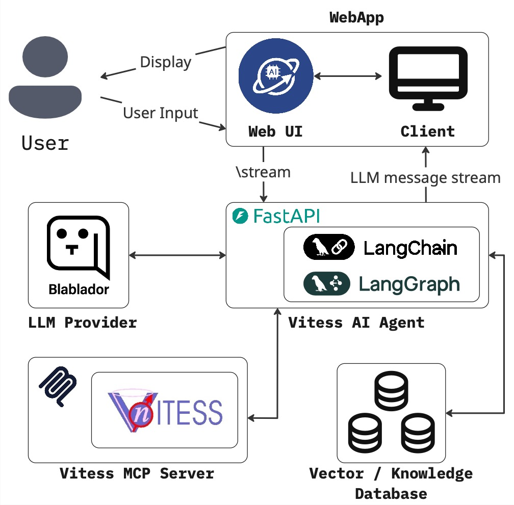
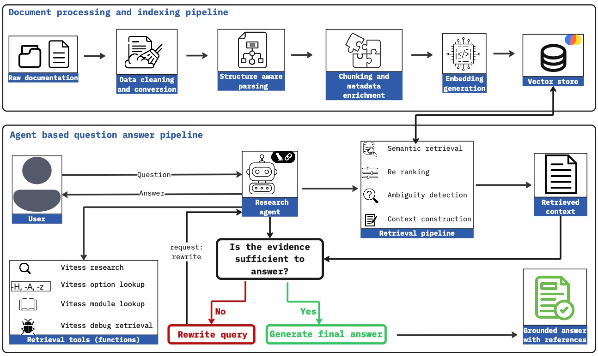

# VITESS AI Agent

<div align="center">
  
</div>

**VITESS AI Agent** is a chat assistant that helps you set up, run and understand [VITESS](https://vitess.fz-juelich.de) neutron scattering simulations. You describe what you want in plain language; the agent configures the VITESS modules with you, runs the simulation, and shows you the results. It can also answer questions about VITESS straight from its manual.

It is part of **Jülich Neutron AI Agents (JüNA)**, a set of AI assistants that help researchers use the knowledge and software of JCNS. It runs entirely on your own computer with Docker.

## What it can do

- **Guided simulation**: configure and run one simulation step by step. The agent goes through the modules in the right order, asks you whenever it needs a decision, and checks each module's settings before anything runs.
- **Advanced mode**: plan a parameter sweep, for example the guide's m-value over three values, and let the agent run all the simulations for you and report what each one did.
- **Ask about VITESS**: what a command-line flag means, which parameters a module takes, what an option does. Answers come from the VITESS manual and say where in the manual they were found.
- **See the results in the chat**: monitor data comes back as plots, and output files can be downloaded.
- **Use your own input files**: upload neutron source files, an instrument file or a guide file from the sidebar.
- **Keep your conversations**: past chats stay in the sidebar, where you can rename or delete them.
- **Choose your model**: works with [Blablador](https://sdlaml.pages.jsc.fz-juelich.de/ai/guides/blablador_api_access/) (Helmholtz).

## Supported VITESS modules

A simulation runs these modules in this order:

| Module | What it does |
| --- | --- |
| read-in | Reads the neutron source from your input files |
| guide | Describes the neutron guide and its geometry |
| writeout | Writes the neutrons that reach this point to a file |
| monitor 1D | Measures a 1D distribution of the arriving neutrons |
| monitor 2D | Measures a 2D distribution of the arriving neutrons |
| capture flux | Gives the flux a gold-foil activation measurement would show |

## How it works

### System overview

You chat with the agent in a web page. Your messages go to the agent server, which uses a language model to decide what to do next. It runs VITESS through a separate VITESS service (an MCP server, a standard way for AI agents to call tools) and looks things up in the VITESS manual stored in a vector database. Replies, plots and files stream back to the chat.

<div align="center">
  
</div>

### Answering questions from the VITESS manual

Questions about VITESS itself are answered with the [`vitess-rag`](https://github.com/neutron-simlab/vitess-rag) package, which works in two stages:

- **Preparing the manual**: the VITESS documentation is cleaned up, split into small pieces while keeping its tables and equations intact, and stored in a searchable database.
- **Answering a question**: the agent searches the manual with tools for general questions, command-line flags and single modules. If what it found is not enough, it rephrases the search and tries again. The final answer points to the part of the manual it came from.

<div align="center">
  
</div>

## Getting started

### What you need

- [Docker](https://docs.docker.com/get-docker/) with Docker Compose
- Git
- A [Blablador API key](https://sdlaml.pages.jsc.fz-juelich.de/ai/guides/blablador_api_access/). The chat can also run on an OpenAI key, but questions about the manual always need the Blablador key.

### 1. Get the code

The agent is built on [`juena-core`](https://github.com/neutron-simlab/juena-core), which has to sit in a folder next to this one:

```sh
mkdir vitess-ai-workspace
cd vitess-ai-workspace
git clone --recurse-submodules https://github.com/neutron-simlab/Vitess-AI-Agent.git
git clone https://github.com/neutron-simlab/juena-core.git
git -C juena-core checkout "$(cat Vitess-AI-Agent/.juena-core-revision)"
cd Vitess-AI-Agent
```

If you cloned without `--recurse-submodules`, run `git submodule update --init --recursive` once.

### 2. Add your settings

```sh
./vitess env
```

This creates a `.env` file. Open it and set:

- `POSTGRES_PASSWORD`: any password you choose, for the database that keeps your conversations
- `BLABLADOR_API_KEY`: your Blablador key (or `OPENAI_API_KEY` for OpenAI)

### 3. Start the agent

```sh
./vitess up
```

The first start builds VITESS and takes a few minutes. Then open **http://127.0.0.1:9601** in your browser. The page is only reachable from your own computer.

### 4. Prepare the VITESS manual (once)

```sh
./vitess index-docs
```

This prepares the manual for searching and sends it to the Blablador embedding service once. Until you run it, the agent tells you the manual is not available.

## Everyday commands

| Command | What it does |
| --- | --- |
| `./vitess up` | Start the agent |
| `./vitess down` | Stop it (your conversations and files are kept) |
| `./vitess health` | Check that everything is running |
| `./vitess logs` | Follow the agent's log |
| `./vitess help` | List all commands |

Run `./vitess install` once to use `vitess` from any folder.

More settings, such as the web page port or LangSmith tracing, are described in [`env.example`](env.example).

## For developers

```sh
uv sync --frozen
./vitess test
```

| Folder | Contents |
| --- | --- |
| `app/` | The web interface |
| `src/vitess_ai/agents/` | The two agents and the module specialists, with their prompts |
| `src/vitess_ai/mcp/` | The VITESS service that runs the simulations |
| `src/vitess_ai/retrieval/` | The tools that search the VITESS manual |
| `rag/vitess-rag/` | The VITESS manual and its search pipeline (Git submodule) |
| `tests/` | The test suite; `tests/data/README.md` explains the VITESS output fixtures |

<details>
<summary>Reusing the manual index from the first-generation agent</summary>

Stop the agent, copy the old index into the new (empty) volume, then start it again. The copied files must belong to the image's user (uid 10001).

```sh
docker compose stop vitess-app
docker run --rm \
  -v vitess-ai-agent_vitess-rag:/src:ro \
  -v vitess-ai-chroma:/dst \
  alpine sh -c 'test -f /src/chroma_db/chroma.sqlite3 && test -z "$(find /dst -mindepth 1 -maxdepth 1 -print -quit)" && cp -a /src/chroma_db/. /dst/ && chown -R 10001:10001 /dst'
docker compose up -d vitess-app
```

If the old stack used a different Compose project name, replace `vitess-ai-agent_vitess-rag` with its volume from `docker volume ls`. After a future re-index, `collections.config_json_str` in `chroma.sqlite3` must stay `{}`, because Chroma 1.5.9 cannot reopen the copied index otherwise.

</details>

## License

MIT License. Copyright (c) 2025-2026 Ahmad Z. Ihsan - JCNS Neutron SimLab. See [LICENSE](LICENSE).
